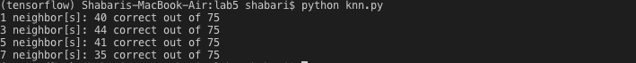
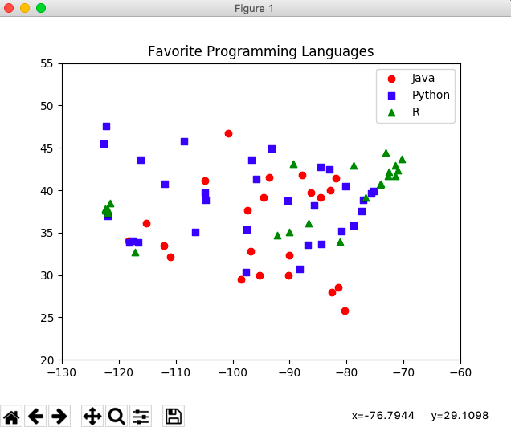
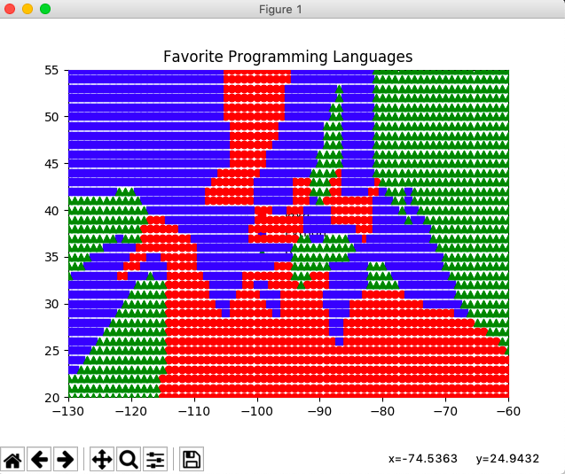
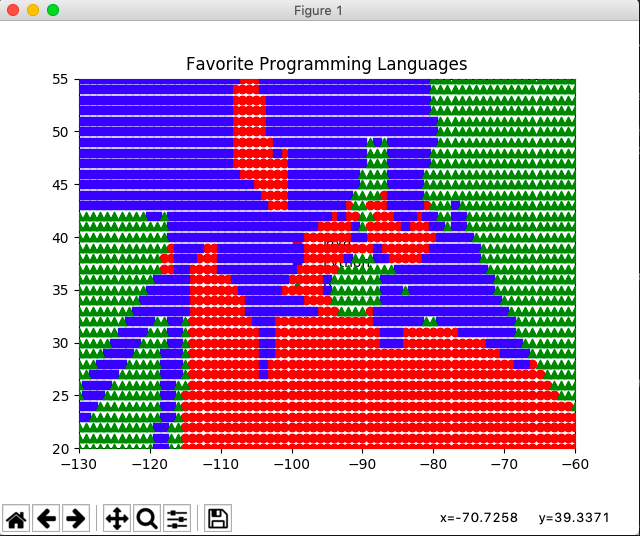
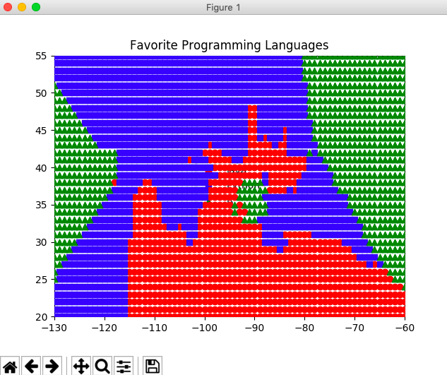

# Lab 5

Complete all TODOs functions from _knn.py_ and _plots.py_

## Submission

Check in all your work (data.py, knn.py, and plots.py) to new Lab 5 Github repository named 'cmpe255-spring19-lab5' including all screenshots of the plots you have generated.

> Jupyter is not required for this lab. Hence, no need to submit Jupyter session file.s 

# cmpe255-spring19-lab5

KNN Classifier that classifies and plots the popular programming languages across USA for a given set of latitudes and longitudes.
A scatter series is then plotter based on KNN predictions. 

## Screenshots of usage
### Output predictions

### Original dataset plot

### Scatter series for k=1

### Scatter series for k=3

### Scatter series for k=5

